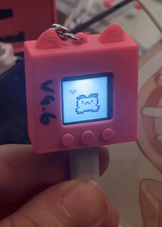
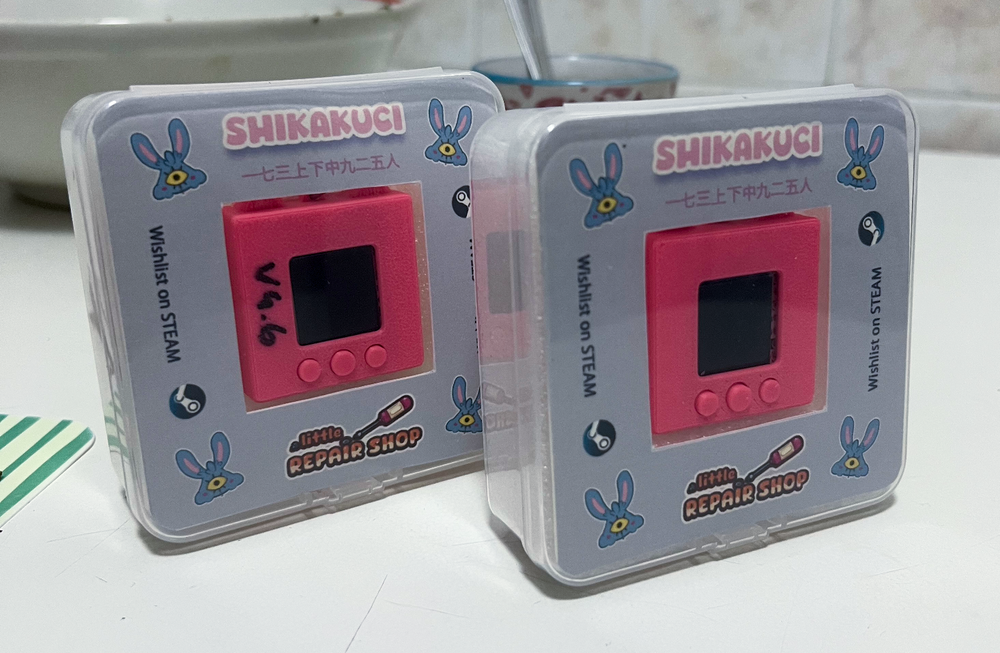

# Shikakuchi

A portable toy device inspired by the game [Little Repair Shop](https://eventhorizonschool.itch.io/little-repair-shop).

[Add it to your wishlist on Steam!](https://store.steampowered.com/app/3247390/Little_Repair_Shop/)

---

## How to build your own Shikakuchi

### What you’ll need:

- A 3D Printer
- A [Wemos Lolin S3 Mini Pro](https://www.wemos.cc/en/latest/s3/s3_mini_pro.html) ESP32 board

### Instructions:

- **For Bambu Lab 3D Printers**: simply open **Shikakuchi.3mf** in [Bambu Studio](https://bambulab.com/en/download/studio), and you're ready to print.

- **For Other 3D Printers** (using slicer software like [UltiMaker Cura](https://ultimaker.com/it/software/ultimaker-cura/) or [PrusaSlicer](https://www.prusa3d.com/prusaslicer/)): add the following STL files to your slicer:

  - `Shikakuchi.stl`
  - `Shikakuchi_buttons.stl`
  - `Shikakuchi_back.stl`
  - `Shikakuchi_padding.stl`

Scale all models uniformly to **370%** for proper dimensions.

- **Flashing the Board**: Open `shikakuchi.ino` with the [Arduino IDE](https://www.arduino.cc/en/software). Use [this guide](https://www.wemos.cc/en/latest/tutorials/s3/get_started_with_arduino_s3.html) to upload the sketch onto your Lolin S3 Mini Pro.

---

Have fun building your Shikakuchi! 😛

